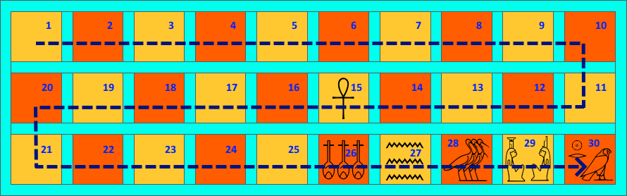

# Senet OpenAI Gym

- [Rules](#rules)
- [Installation](#installation)

---
## <a name="rules"></a>Rules

Senet is a board game for two players. It is played on a board which consists 3 rows of 10 squares. 
Squares are known as "houses".

<p align="center">
   
</p>

Some houses are marked with hieroglyphic pictograms and have special meaning:
  * **15**: marked with ankh 𓋹, is the **Rebirth House**
  * **26**: marked with 𓄤𓄤𓄤, is the **House of Happiness**, or **Pretty House**
  * **27**: marked with water sign 𓈗, is the **House of Water**
  * **28**: marked with three ba birds 𓅢, is the House of **Three Truths**
  * **29**: marked with two women 𓁐 with crowns, is the **House of Re-Atum**, or **House of Isis and Nephthys**
  * **30**: marked with flacon 𓅃, is the **House of Re-Horakhty** 

Each player starts with 5 or 7 pieces, which are known as "dancers". Due to specific shape
of the pieces, they are referenced as "cons" for one player, and as "spools" for another. 
The goal of the game is to guide own dancers along a specific path and finally
bourne them all off the board before the opponent does so. Dancers can be bourne off the board 
once they reach one of five special houses: House of Happiness, House of Water, House of Three Truths,
House of Re-Atum or House of Re-Horakhty.

Dancers are moved from their staring houses to the last house along the board following an S-shape path. 
Namely, from left to right in the upper row, from right to left in the middle row, and, 
finally, from left to right again in the bottom row. At the beginning dancers are 
placed in alternate houses starting from first house along
the line of their movement. That is, for the game with 5 pieces, "cons" are placed in houses 
1, 3, 5, 7 and 9, whereas "spools" are placed in houses 2, 4, 6, 8 and 10. First move takes
the "spools" player.

In each turn one dancer can move forward or backward 
to a given number of steps. The game is 
equipped with 4 sticks, one side of each is black, another side is colored. The player 
having a turn throws these sticks. The number of steps is the number of sticks come up 
colored sides. If all sticks come up black side, the number of steps is 5.
Player obtains an extra move if the number of steps is 1, 4 or 5.
Therefore, the turn is passes only if the number of steps is 2 or 3. 

Normal dancer move direction is forward. However, if no dancer can move forward,
player should move one of the dancers in backward direction to the same
number of steps. If no dancer can move neither forward no backward, the
turn is passed to another player independently of what number of steps was.
No more move backward is allowed for dancers which reached House of Happiness

No house can be occupied with more than one dancer. Dancer can not move
to the house where another dancer of the same player is located. If, however,
the landing house is occupied with dancer of another player, and the move
is legal, the dancers swaps their houses: the opponent's dancer is 
moved to the house of depart of the player's dancer. 
In this case Player's dancer *beats* the opponent one.

Such move is legal if landing house is not *safe* and the opponent dancer
is not *protected*. The *safe* houses are all special houses: House of Rebirth,
House of Happiness, House of Water, House of Three Truths, House of Re-Atum, 
and House of Re-Horakhty. If two dancer of the same player stand next to 
each other, they *protected* each other. Depending on particular rules,
some other combinations of dancers are considered as *protected*. 
Also in some cases it is not legal for dancer to jump over 
some special groups of opponent's dancer, the *blockades*. 
The exact description of *blockade* depends on particular rules.

There are lot Senet rules variations, we consider two of them: 
* simple and most known ones, well adopted for algorithmic implementation, 
we reference it **Kendall rules**, although the original
rules proposed by Tim Kendall are more complicated.
* less known rules by Dmitry Skyruk, which we reference **Skyruk rules**,
which probably have deeper connection with original Egyptian game.

Below we explain what *blockade* and *protected* dancer mean in each
version of Senet rules, and how to move when landed to a special house.

### Kendall

* *Blockade*: three or more opponent's dancers in a row, all dancers
should stand next to each other
* *Protected*: two or more opponent's dancers in a row, none of dancers
within protected group can be beaten
* *Special Houses*:
  * House of Happiness is mandatory. Dancer is not allowed to move further
  if this house is not visited. If, for example, dancer is in house 25, 
  next to the House of Happiness, the player should while number of
  steps is exactly 1 to move the dancer to the House of Happiness
  * For a dancer in the House of Happiness:
    * if number of steps is 5, the dancer bourne off the board
    * if number of steps is 4, 3, or 2, it is moved to the House of 
  Re-Horakhty, House of Re-Atum or House of Three Truths respectively
    * if number of steps is 1 it is moved to the House of Water, but...
  * The House of Water is a trap, the dancer which lands here gets drawn
  in the water, and reappears in the House of Rebirth. If House of Rebirth is 
  occupied, the dancer is moved to the first empty house preceding the 
  House of Rebirth
  * The dancer in the House of Three Truths can be bourne off the board
  if the number of steps is 3, this is the only legal move for this dancer
  * The dancer in the House of Re-Amun can be bourne off the board
  if the number of steps is 2, this is the only legal move for this dancer
  * The dancer in the House of Re-Horakhty can be bourne off the board
  if the number of steps is 1, this is the only legal move for this dancer

### Skyruk

* *Blockade*: two or more opponent's dancers in a row, all dancers
should stand next to each other
* *Protected*: when two or more dancers stand next to each other, the
first and the last one are protected. Unlike Kendall rules, the inner
dancers are not protected and can be beaten
* *Special Houses*:
  * House of Happiness is mandatory. Dancer is not allowed to move further
  if this house is not visited. If, for example, dancer is in house 25, 
  next to the House of Happiness, it lands to the House of Happiness
  whatever the number of steps is. 
  * Once a dancer reaches the House of Happiness, sticks should be 
  thrown again and this dancer performs an extra move according 
  to the thrown number of steps
    * if number of steps is 1, the dancer is moved to the House of Water,
if House of Water is occupied, dancer is moved to the House of Rebirth, if House of Rebirth is 
  occupied, the dancer is moved to the first empty house preceding the 
  House of Rebirth
    * if number of steps is 2, 3 or 4, the dancer is moved to the House of
Three Truths, House of Re-Amun or House of Re-Horakhty, if the landing
house is occupied, the dancer is moved to the House of Water instead, if
the House of Water is occupied as well, the dancer is moved to the House
of Rebirth or to the first empty house preceding the House of Rebirth
    * if number of steps is 5, the dancer is bourne off the board
  * Unlike Kendall rules, the House of Water is necessary is a trap, instead
    * if number of steps is 1, 2 or 3, the dancer is moved to the House
of Rebirth or to the first empty house preceding the House of Rebirth
    * if number of steps is 4, the dancer is bourne off the board
    * if number of steps is 5, the dancer remains in House of Water and
the turn is passed to the opponent
  * The dancer in the House of Three Truths can be bourne off the board
  if the number of steps is 3, this is the only legal move for this dancer
  * The dancer in the House of Re-Amun can be bourne off the board
  if the number of steps is 2, this is the only legal move for this dancer
  * The dancer in the House of Re-Horakhty can be bourne off the board 
regardless the number of steps.

---
## <a name="installation"></a>Installation
```
git clone https://github.com/mecotrade/gym-senet.git
cd gym-senet/
pip install -e .
```
